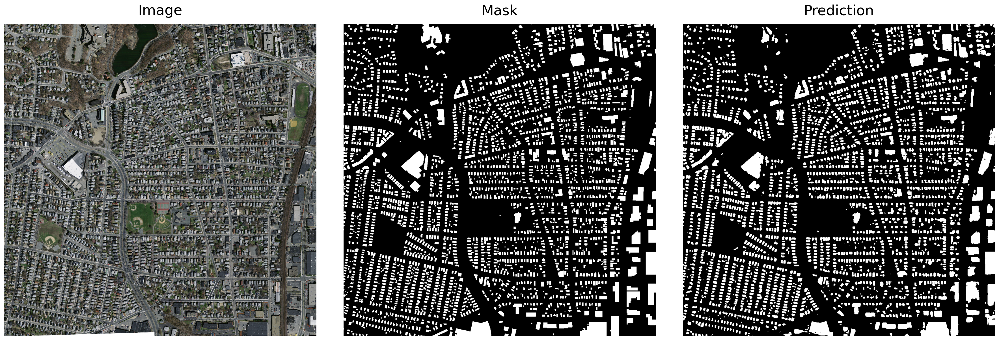
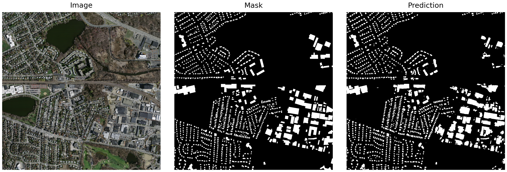

# Massachusetts Building Segmentation

This repository provides a complete deep learning pipeline for **building footprint segmentation** using the [Massachusetts Buildings Dataset](https://www.cs.toronto.edu/~vmnih/data/). The model generates **binary segmentation masks**, accurately identifying building structures in large-scale aerial imagery (1000x1000 px).

## Key Features & Design Choices

* **Efficient U-Net Architecture**
  A **lightweight U-Net** with an *EfficientNet-B3* encoder backbone, chosen for balance between model capacity and inference speed. EfficientNet-B3 offers a strong feature representation without overfitting on the small dataset.

* **Multi-Scale Feature Extraction with Inception Modules**
  The decoder incorporates **inception-style convolutional blocks** to improve **scale invariance**. This design enables the model to capture both fine-grained details of small buildings and the overall structure of larger complexes, addressing the challenge posed by high-resolution aerial images.

* **Transfer Learning for Data Efficiency**
  Leveraging **ImageNet-pretrained weights** accelerates convergence and improves generalisation, mitigating the impact of limited labeled data.

* **Hybrid Loss Function**
  A combination of **Weighted Binary Cross-Entropy** and **Dice Loss** ensures a balance between **pixel-level precision** and **overall mask shape quality**. Alternative losses like focal and Tversky were also explored but provided comparable results, validating this choice.

* **Dynamic Learning Rate Scheduling**
  **Cosine Annealing** adjusts the learning rate during training, helping the model achieve smoother convergence.

## Results

Training with the EfficientNet-B3 backbone and inception-based multi-scale features produced:

* **Validation IoU:** ~0.64
* **Validation Dice Score:** ~0.78

These metrics indicate **strong and stable segmentation performance**, demonstrating the model's ability to generalize to complex urban scenes even with relatively small training data.

## Run Inference

You can generate building segmentation masks on new aerial images using:

```bash
python src/inference.py --input path/to/image.png --output predictions/
```

## Example Predictions

Sample outputs highlighting predicted building footprints in white, illustrating the model's capability to detect structures across multiple scales:

<p>
  
  
  
</p>